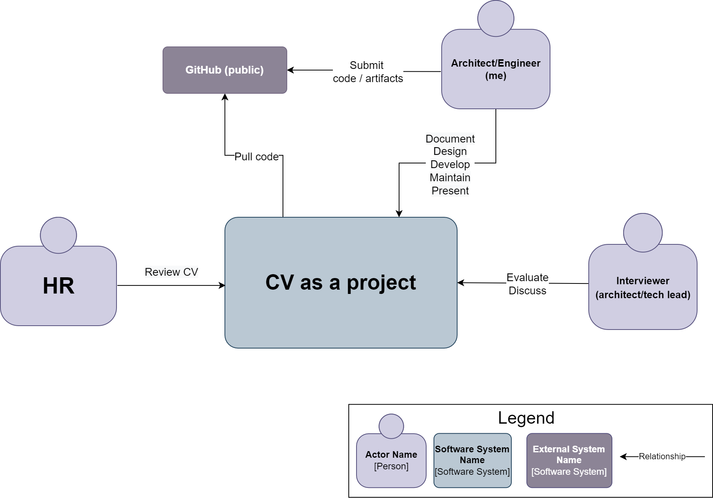
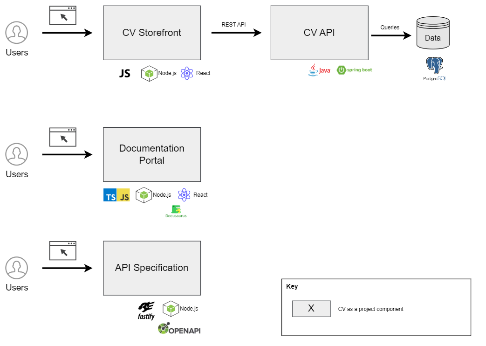

# Solution Document

:::note
_Different organization may use different templates for 'design' or 'solution document'. Below I'm trying to cover the most popular and useful sections.
Specific sections and documentation approach is a good subject for discussion on interview._ 
:::


<!-- ```plantuml
@startuml

scale 1.5

skinparam ParticipantBorderColor black
skinparam ParticipantBackgroundColor white
skinparam ArrowColor black
skinparam Shadowing false
skinparam lifeLineStrategy strictuml
skinparam SequenceLifeLineBorderColor grey
skinparam SequenceBoxBorderColor transparent
skinparam sequence {
DividerBackgroundColor white
DividerBorderColor grey
DividerBorderThickness 1
}

title Sequence Diagram (test)
actor Customer

participant storefront as "Storefront" order 1
participant api as "API" order 2
participant db as "DB" order 3

Customer -> storefront: Open "Projects" page
storefront -> api: Get Projects
api -> db: fetch data

@enduml
```


## TBD
## TBD
## TBD -->


## Stakeholders
***

| Name | Role | Notes |
| -------------------- | ----------------------------------| ---------------------------------- |
| Alex Surma | PO | Represents a "biz" part, goals, KPI vision and requirements |
| Alex Surma | Solution Architect | Drives solution and technical design |
| Alex Surma | FE and BE Dev | I'm doing dev too ;) |
| Alex Surma | QA | Again me ;) |
| Alex Surma | SRE/DevOps | Have to play this role too |
| N/A | HRs | Users of my public personal 'CV' site |
| N/A | Architects/Directors/<br /> Tech leads | People who might interview me, reviewers of current documentation,<br /> back-end components, API, source code |


## Definitions, Acronyms, Abbreviations
***

| Term | Description | Reference |
| -------------------- | ----------------------------------| ----------------------------------------------- |
| CV | Curriculum Vitae. A CV is a comprehensive document that outlines a person's education, work experience, skills, achievements, and other relevant information. | |
| C4 model | One of approaches for diagramming and documenting software architectures| [https://c4model.com/](https://c4model.com/) |
| Quality Attribute | Quality attributes in software architecture refer to the various characteristics or properties that define the overall quality and behavior of a software system. These attributes are crucial in determining how well a system performs and meets its intended objectives. Sometimes are still referred as NFRs  | |
| MACH | Modern enterprise technology that is **M**icroservices-based, **A**PI-first, **C**loud-native SaaS, and **H**eadless | [https://machalliance.org/](https://machalliance.org/) |

## Overview
***
:::note
_This section provides the context for Design / Solution Architect work.  Any architecture should be designed having all context details in mind.
Diagram showing new feature/system in context or details of a business problem are good candidate for this section\
Potentially section may also cover:_ 
 - _Technology Strategy (if any exist in the company)_
 - _Business Architecture, org structure of company/department_
 - _Current Data or Security environment of company/department_
:::

### Problem statement

Working on large enterprise projects with lot of legacy solutions, internal policies and strict NDAs makes it hard to share outcome of architect's work or evaluate skills. Wite-boarding sessions may partially address the problem, however such sessions may have their own problems too (lack of time, stress, etc..)   

* me as an **interviewer** always find hard to check 'architect' skills and experience without looking into real deliverables and artifacts. What I usually get is a PDF/Word file and have to prepare questions that should somehow confirm past experience.       
* me as an **interviewee** would like to
    * better and more efficiently present myself as a professional engineer/architect;
    * demonstrate design, documentation, tech skills as a set of artifacts rather than plain, boring text in PDF/Word (not mentioning that it can be easily AI generated nowadays);
    * have all artifacts public and handy so I can elaborate on them, use as starting points or reference during potential white-boarding sessions with my interviewers


:::info
C4 Model has been used for creating an above diagram. However in real live it doesn't always have to be formal and may depend on the audience/stakeholders
<br />
Example - TBD<br />
Example - TBD<br />

:::

## Requirements
***

### Business goals
If I were to define something measurable here I would do this as an 'interview to offer' KPI
e.g. increase my 'interview to offer' rate from 10% to 30%

### Functional requirements

Well, to keep it simple my public CV site should have following pages:
* landing page describing idea of "CV as a project";  
* 'about' page  - personal information, just a short summary about me;
* 'resume' page - this is basically a typical CV with sections like Education, experience,, skills, courses;
* 'projects' page - key achievements/solutions that I can publicly share and show off;
* 'stats' page - place for 'dynamic' stats like age, number of GitHub commits, etc.. _low priority, can be excluded from MVP/initial phase_
* 'contact' page - _low priority, can be excluded from MVP/initial phase_   


### Non-functional requirements
This is what really drives an architecture and design in my case as 'functional requirements' could be implemented as set of static HTML pages.\
NFRs may represent key stakeholders’ quality criteria for the solution = > using a different section for them    

### Quality attributes
#### Global
| Category | Sub category | Detailed requirement | How to measure |
| :------------------- | :---------------------------- | ------------------------------------------- | :---------------------- |
| Maintainability | Simplicity | Overall solution shouldn't be 'over engineered' and should serve its main purpose of presenting design/documentation/tech skills | [Manual] system audit |
|                 | Code quality | All project code should have a minimum quality that will be defined through quality gate tool ||
| Presentability | Presentability | CV UI and project documentation should have a public access, so it's easy to share and present on interview  | |
|                | Up to date tools / technologies | Common sense here. As this is a 'pet like' project I can spend much time on adding the most modern frameworks. On the other hand can't build it using JSPs with JBOSS as an application server ;)  | [Manual] architecture review |
| Availability | Uptime | Not a strong requirement in my case. I can 'shutdown' all components without business impact  | N/A |
|||||


#### API
| Category | Sub category | Detailed requirement | How to measure |
| -------------------- | ----------------------------- | ------------------------------------------- | ----------------------- |
|Performance|Latency|API average response time should be less than 100 ms|Adding this to see if i can challenge myself and measure|
| | | ||
|||||


### Constraints
I would put just one constraint here - budget. Operational costs shouldn't be be more then ~15 USD per month.  

### Dependencies & assumptions
Nothing to mention here as there is no dependency on external vendors / other people 

## Solution Design
***

:::note
[[TODO:Section description]]

_If replatforming or significant changes should include both 'as is' and 'to be' sections

- _Baseline Design/Architecture_
- _Target Design/Architecture_

business-oriented diagram (often referred as high level diagram)
logical view
components
data

High-level solution structure diagram (highly recommended).
List of architecturally significant components and descriptions of their technology stack and integration with each other.
architectural styles/patterns to be used.

:::

### Summary

CV-as-a-project solution should follow MACH architecture style, layered architecture with MVP as a pattern for 'dynamic' data on storefront. 

Logically "CV-as-a-project" should be split into following modules (could be mapped into deployable Java/NodeJS/static HTML packages):
* **CV storefront**: TBD short description
* **Tech Documentation Portal**: TBD short description
* **Back-end CV API**: TBD short description 


### Key Components
\
\

<div align="center">Diagram</div>

| System/Component | Description | Functionality/Capability | Tech documentation / URL |
| :-------------------- | :----------------------------- | :------------------------------------------- | :----------------------- |
| CV Storefront||||
| CV API||||
| DB ||||
| Documentation ||||
| API Spec ||||

### Infrastructure / Deployment
TBD


### API Specification
API-First approach - TBD - link 

### Database schema


## Architecture decision records
| Issue | Impact | Status |
| ---------------------- | ---------------------------------- | ----------------------------------- |
| | | |

## Change Log
## References
## Appendix
### Examples