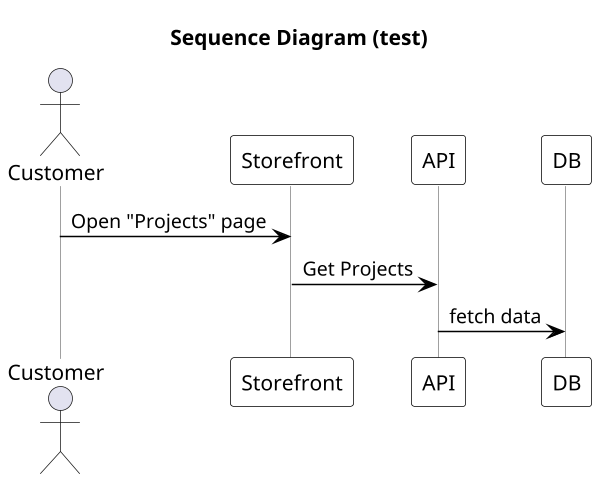

# Solution Document

```plantuml
@startuml

scale 1.5

skinparam ParticipantBorderColor black
skinparam ParticipantBackgroundColor white
skinparam ArrowColor black
skinparam Shadowing false
skinparam lifeLineStrategy strictuml
skinparam SequenceLifeLineBorderColor grey
skinparam SequenceBoxBorderColor transparent
skinparam sequence {
DividerBackgroundColor white
DividerBorderColor grey
DividerBorderThickness 1
}

title Sequence Diagram (test)
actor Customer

participant storefront as "Storefront" order 1
participant api as "API" order 2
participant db as "DB" order 3

Customer -> storefront: Open "Projects" page
storefront -> api: Get Projects
api -> db: fetch data

@enduml
```

## TBD
## TBD
## TBD
