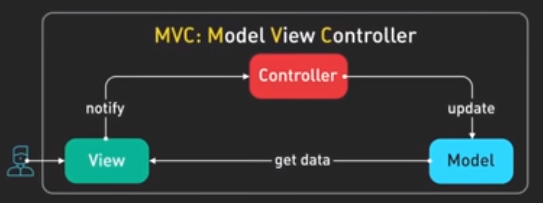
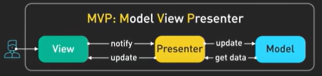
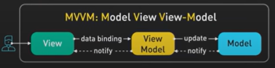
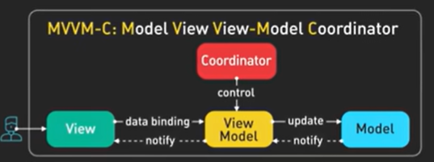

# Application Architecture Patterns

***
## Model Vew Controller

## Model View Presenter 

## Model View View Model 

## Model View View Model Coordinator

## View Interactor Presenter Entity Router

Very short summary:

**MVC** - might be perfect for smaller projects, where simplicity is a key\
**MVP** - when you need more testability\
**MVVM / MVVM-C** - in reactive programming especially with modern frameworks\
**VIPER** - go to for larger applications where a clean separation and scalability are critical 