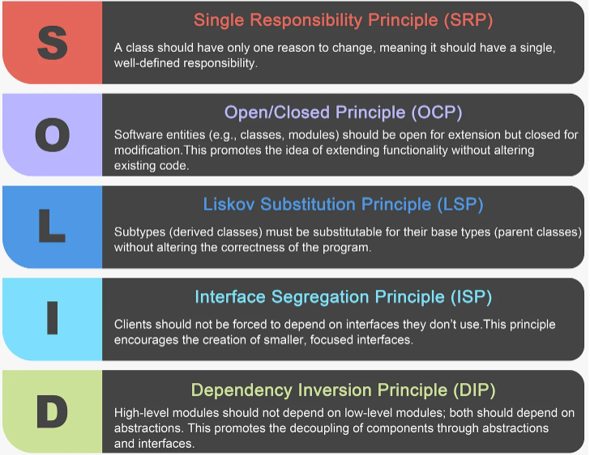

# SOLID

Maintainability: Following sound design principles makes code more maintainable. When code is well-structured and adheres to these principles, it becomes easier to identify and fix issues, add new features, and make improvements without causing unintended consequences.

Scalability: Well-designed software is scalable. It can accommodate changes and growth in requirements without requiring extensive rework or becoming increasingly complex.

Code Reusability: Adhering to design principles often leads to code that is more reusable. Reusable components save time and effort in development and testing.

Collaboration: Design principles provide a common framework for developers to work within. This common understanding promotes collaboration and reduces misunderstandings among team members.

Reduced Bugs and Pitfalls: Following design principles helps to identify and mitigate common programming pitfalls and design flaws. This results in fewer bugs and more robust software.

Future-Proofing: Well-designed software can adapt to changing requirements and technologies. It's an investment in the long-term viability of the software product.

## Single Responsibility Principle (SRP)
The “S” in the SOLID principles stands for the Single Responsibility Principle (SRP), which states that a class should have only one reason to change or, in other words, it should have a single, well-defined responsibility or job within a software system.

## TBD