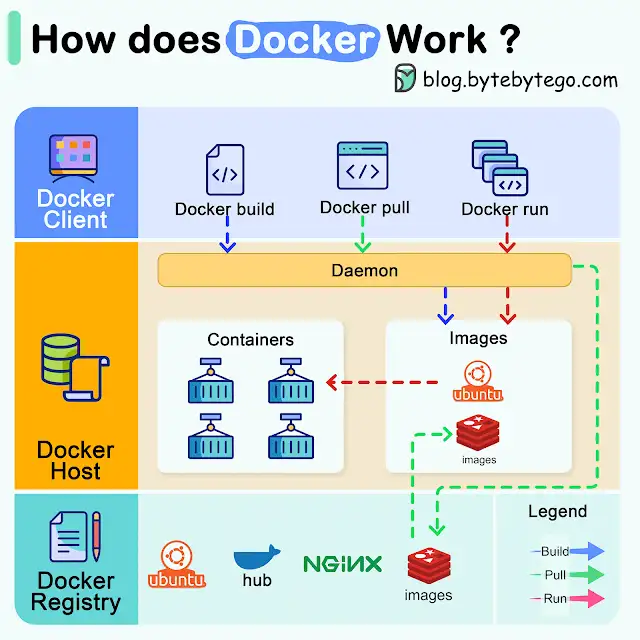

#

- **Docker Client**: This is the interface through which users interact. It communicates with the Docker daemon.
- **Docker Host**: Here, the Docker daemon listens for Docker API requests and manages various Docker objects, including images, containers, networks, and volumes.
- **Docker Registry**: This is where Docker images are stored. Docker Hub, for instance, is a widely-used public registry.
