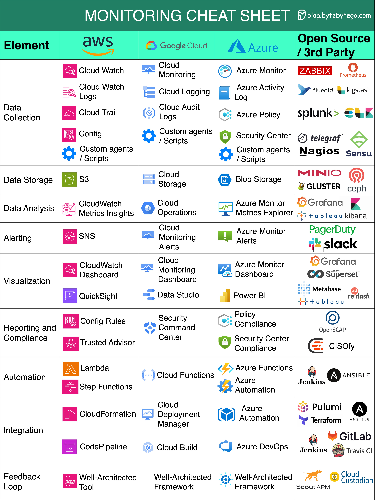

# Monitoring cheat sheet

- **Data Collection**: Gather information from diverse sources to enhance decision-making.
- **Data Storage**: Safely store and manage data for future analysis and reference.
- **Data Analysis**: Extract valuable insights from data to drive informed actions.
- **Alerting**: Receive real-time notifications about critical events or anomalies.
- **Visualization**: Present data in a visually comprehensible format for better understanding.
- **Reporting and Compliance**: Generate reports and ensure adherence to regulatory standards.
- **Automation**: Streamline processes and tasks through automated workflows.
- **Integration**: Seamlessly connect and exchange data between different systems or tools.
- **Feedback Loops**: Continuously refine strategies based on feedback and performance analysis.
