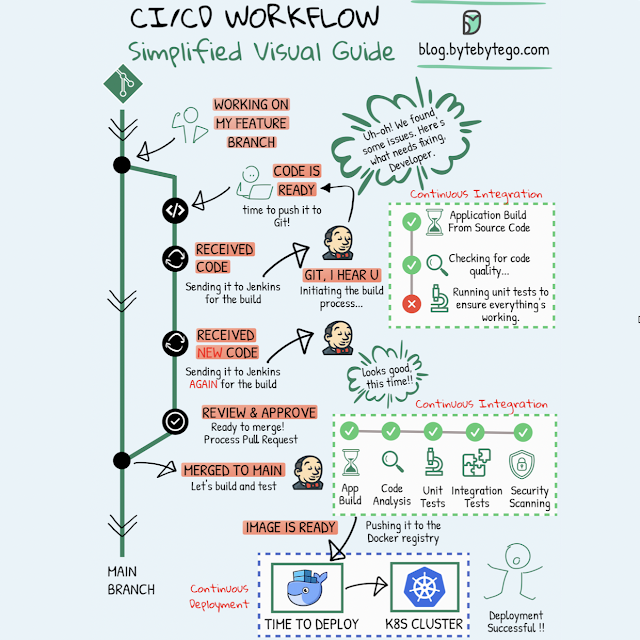

# CI CD Simplified

**Continuous Integration (CI)** is a practice where code changes are frequently combined into a shared repository. This process includes automatic checks to ensure the new code works well with the existing code.

**Continuous Deployment (CD)** takes care of automatically putting these code changes into real-world use. It makes sure that the process of moving new code to production is smooth and reliable.