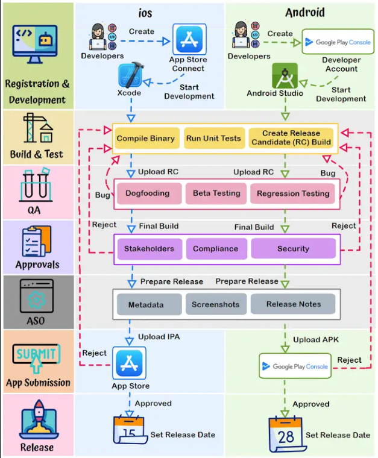

# Release a Mobile App - Steps

## Typical Stages 

1. Registration & Development (iOS & Android): 
    - Enroll in Apple's Developer Program and Google Play Console as iOS and Android developer
    - Code using platform-specific tools: Swift/Obj-C for iOS, and Java/Kotlin for Android

2. Build & Test (iOS & Android): 
Compile the app's binary, run extensive tests on both platforms to ensure functionality and performance. Create a release candidate build.

3. QA:
    - Internally test the app for issue identification (dogfooding)
    - Beta test with external users to collect feedback
    - Conduct regression testing to maintain feature stability

4. Internal Approvals:
    - Obtain approval from stakeholders and key team members.
    - Comply with app store guidelines and industry regulations
    - Obtain security approvals to safeguard user data and privacy

5. App Store Optimization (ASO):
    - Optimize metadata, including titles, descriptions, and keywords, for better search visibility
    - Design captivating screenshots and icons to entice users
    - Prepare engaging release notes to inform users about new features and updates

6. App Submission To Store:
    - Submit the iOS app via App Store Connect following Apple's guidelines
    - Submit the Android app via Google Play Console, adhering to Google's policies
    - Both platforms may request issue resolution for approval

7. Release:
    - Upon approval, set a release date to coordinate the launch on both iOS and Android platforms