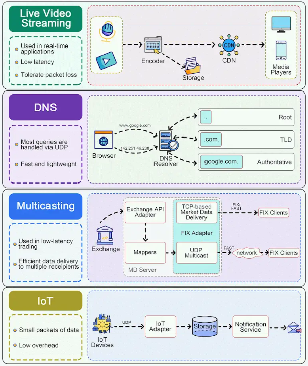

UDP (User Datagram Protocol) is used in various software architectures for its simplicity, speed, and low overhead compared to other protocols like TCP. 

🔹 Live Video Streaming
Many VoIP and video conferencing applications leverage UDP due to its lower overhead and ability to tolerate packet loss. Real-time communication benefits from UDP's reduced latency compared to TCP.

🔹 DNS
DNS (Domain Name Service) queries typically use UDP for their fast and lightweight nature. Although DNS can also use TCP for large responses or zone transfers, most queries are handled via UDP.

🔹 Market Data Multicast
In low-latency trading, UDP is utilized for efficient market data delivery to multiple recipients simultaneously.

🔹 IoT
UDP is often used in IoT devices for communications, sending small packets of data between devices.